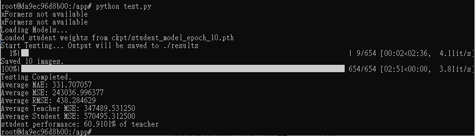
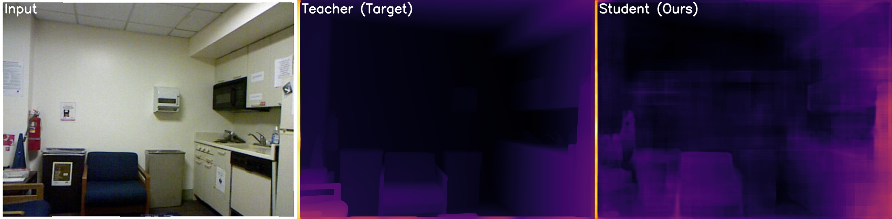
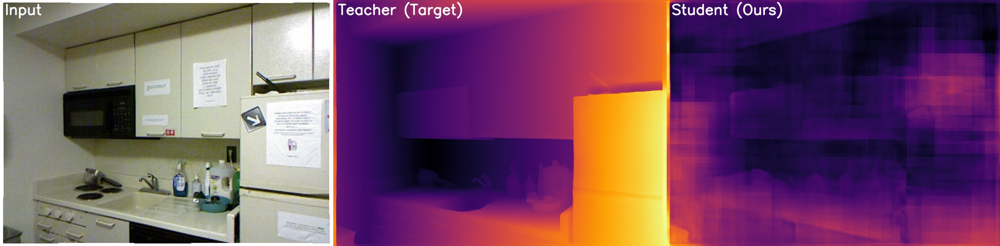

# 研究目標
本研究是為了用更輕量的模型進行單目相對深度估測，使用特徵蒸餾從depthanything v2 vitb模型學習

### 預先準備
根目錄在```depthanything/Depth-Anything-V2/```

在以下位置放置depthanything模型在ImageNet上的預訓練權重
```
depthanything\Depth-Anything-V2\checkpoints\depth_anything_v2_vitb.pth
```
在以下位置放置訓練資料，以nyu2 dataset為例
```
depthanything\Depth-Anything-V2\dataset\data\nyu2_test\
depthanything\Depth-Anything-V2\dataset\data\nyu2_train\
depthanything\Depth-Anything-V2\dataset\data\nyu2_test.csv
depthanything\Depth-Anything-V2\dataset\data\nyu2_test.csv
```
訓練/評估模型使用的資料路徑需與資料集配置路徑一致

### 環境
使用以下指令建置docker環境
```
docker build -t depth-v2 .
docker run --rm -it --gpus all --shm-size=8g -v %cd%:/app depth-v2 bash
```

### 訓練
```
python train.py --epochs [num_epoch] --hyper-para 1.0 --train-csv [train_data_csv]
```
訓練權重儲存在```ckpt/```

### 測試
```
python test.py --checkpoint [ckpt_path] --test-csv [test_data_csv]
```
視覺化測試結果存在```result/```

### 成果



我使用比原始設計更小的Unet作為學生模型，執行10個epoch測試，訓練有擬合的跡象

### 未來計畫
我計畫重新分配硬碟空間，再考慮下一步行動

目前主要有兩項挑戰

第一，還沒有用於判斷相對深度估測模型表現的正式指標

第二，訓練流程中沒有儲存教師模型的提取特徵，導致訓練效率差

### 備註
目前我仍在嘗試其他學生模型，我認為全CNN的視深可能不足以支持ViT模型的性能，但需要另外實驗。
此外，我還沒有調參過。
我把實驗思路寫在depthanything\note.md，僅作為筆記使用。
